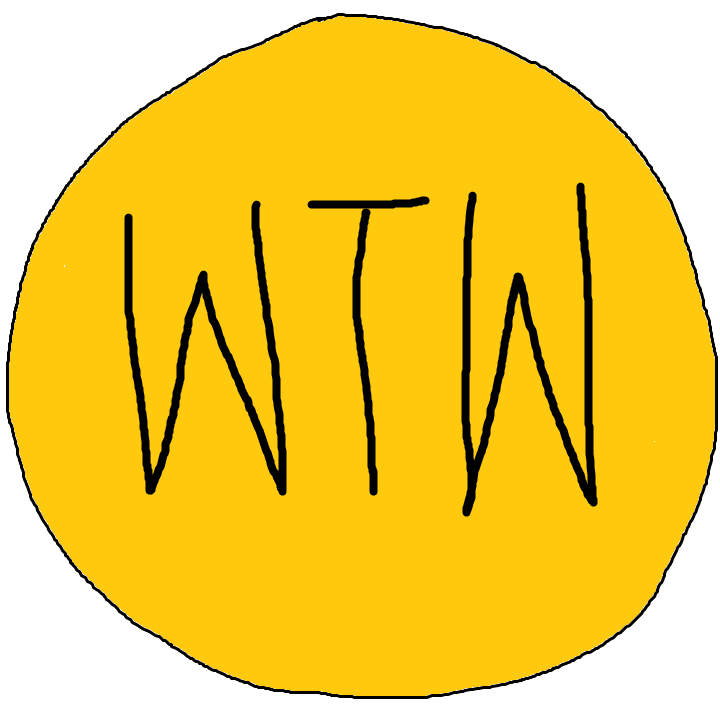
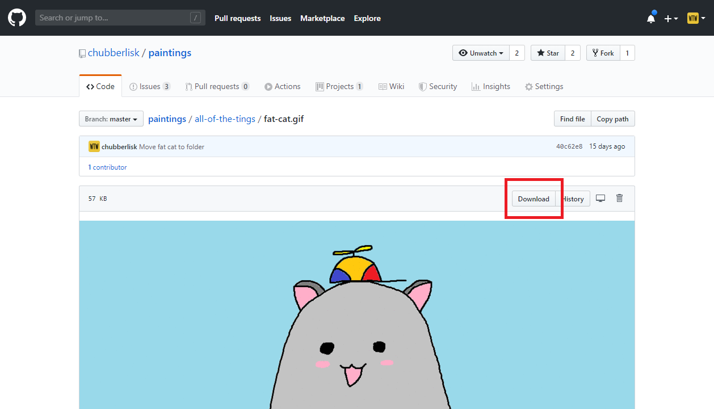
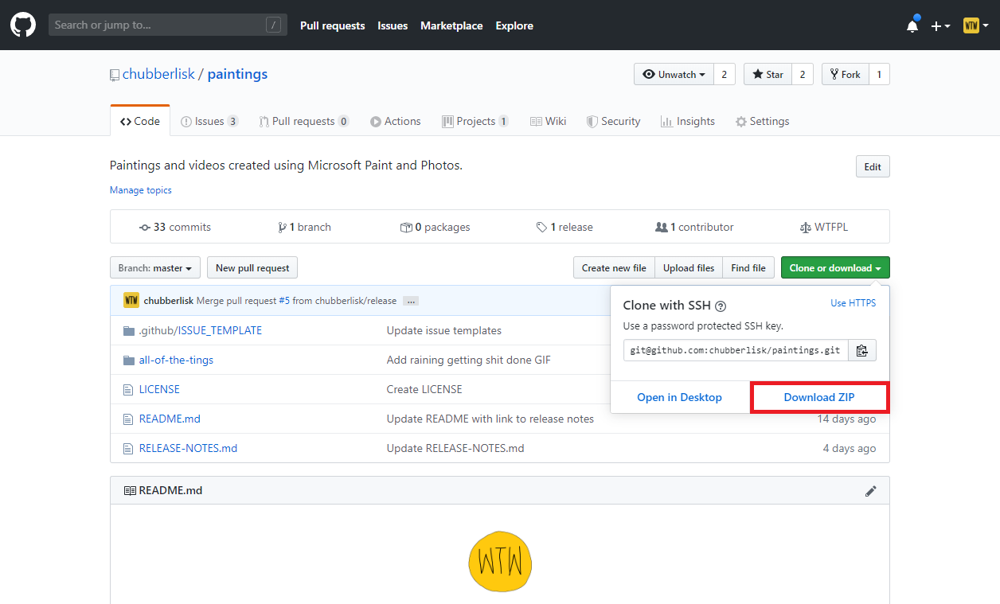

  

  <h3 align="center">Paintings by Wen Ting Wang</h3>

  

    A repository of paintings and videos created using Microsoft Paint and Photos.
     
     
    <a href="https://github.com/chubberlisk/paintings/issues">Request a Painting</a>
  

## Table of Contents

- [About the Project](#about-the-project)
  - [Built With](#built-with)
- [Download](#download)
- [Releases](#releases)
- [License](#license)

## About The Project

Once upon a time, there survived a smol Thing in a big scary world. This was until they saw some seemingly happy faces in response to paintings of a boat and cruise ship. From then onwards, it was decided that the paintings could not stop.

### Built With

- [Microsoft Paint](https://support.microsoft.com/en-gb/help/4027344/windows-10-get-microsoft-paint)
- [Microsoft Photos](https://www.microsoft.com/en-gb/p/microsoft-photos/9wzdncrfjbh4?activetab=pivot:overviewtab)
- [Pixlr X - free image editing online](https://pixlr.com/x/)

## Download

### Downloading a painting

1. Go to the [GitHub repository](https://github.com/chubberlisk/paintings) online
2. Click on the `all-of-the-tings` folder
3. Click on the painting you want to download
4. Click on the `Download` button

  

### Downloading all of the paintings

1. Go to the [GitHub repository](https://github.com/chubberlisk/paintings) online
2. Click on the `Clone or download` button
3. Click on the `Download ZIP` button

  

## Releases

- Each **big boi** release will have a codename which will begin with A until Z and be named after a Yu-Gi-Oh! card owned by _Seto Kaiba_.
- See [RELEASE-NOTES](/RELEASE-NOTES.md) for what's new or go to [Releases](https://github.com/chubberlisk/paintings/releases).

## License

Copyright © 2020 Wen Ting Wang

This work is free. You can redistribute it and/or modify it under the
terms of the Do What The Fuck You Want To Public License, Version 2,
as published by Sam Hocevar. See the [LICENSE](/LICENSE) file for more details.
